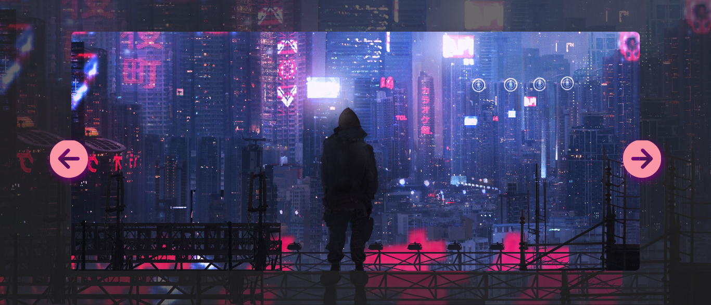

<h1 align="center">Background Slider</h1>

<h2 align="center">Um slider simples de imagens de fundo com tema futurista</h2>

<h2>➢ O que é este projeto?</h2>

  Este projeto é uma aplicação web que permite aos usuários
  explorarem uma coleção de imagens de plano de fundo e escolherem a que desejam usar em seu dispositivo. 
  A aplicação foi desenvolvida utilizando tecnologias web como HTML, CSS e JavaScript.

 Você pode acessar o site através deste link: https://background-slider-tawny.vercel.app/

<h2> ➢ Outras informações</h2>
<ul>
    <li> <strong>Status:</strong> <em>Finalizado</em>
    <li><strong>Linguagens utilizadas:</strong>
    

        
        
        
    

    <li> <strong>Conhecimentos aplicados:</strong>
    <ul>
        <li> 
            Módulos e Funções JS
        </li>
      <li>Eventos DOM</li>
      <li>Responsividade com a função clamp()</li>
    </ul>
</ul>
